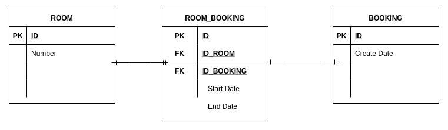
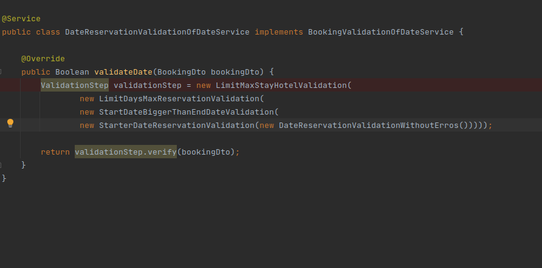
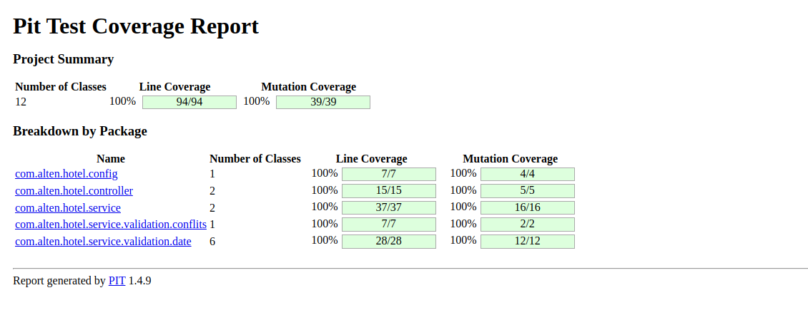
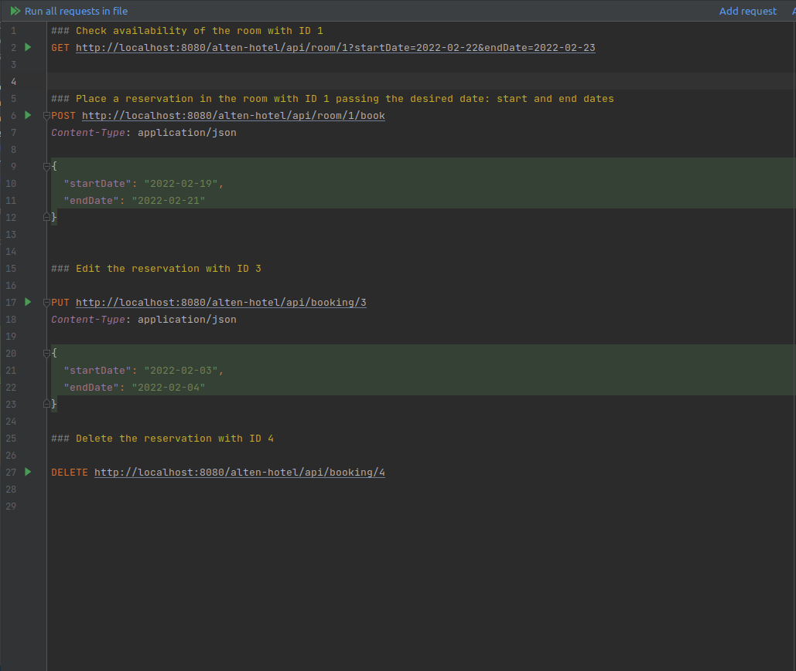

# Project for Alten based on scenario with Hotel with Java and Spring Boot by Ivana Queiroz de Assis

## Architecture

This application was made using the following technologies:

- Java 11
- Spring Boot
- Maven
- Mapstruct
- In-memory database with H2
- Mutation Test with PiTest

### In-memory database with H2

The representation of reservation was made as the following diagram:

In the start-up of the microservice it's insert the some samples data in the tables that is in the file data.sql.

### Chain of responsability for validation in Date

This design pattern was used for verifying the requirements of the scenario, which was: the stay can’t be longer
then 3 days that was represented by the class 'LimitMaxStayHotelValidation', can’t be reserved more than 30 days in advance
that was represented by the class 'LimitDaysMaxReservationValidation' and all reservations start at least the next day of booking
that was represented by the class 'StarterDateReservationValidation'.

This validations was chained in the following class:

### Mutation test

### Requests

